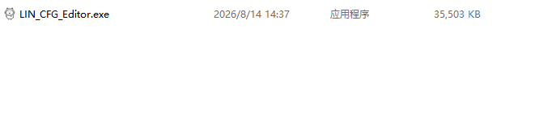
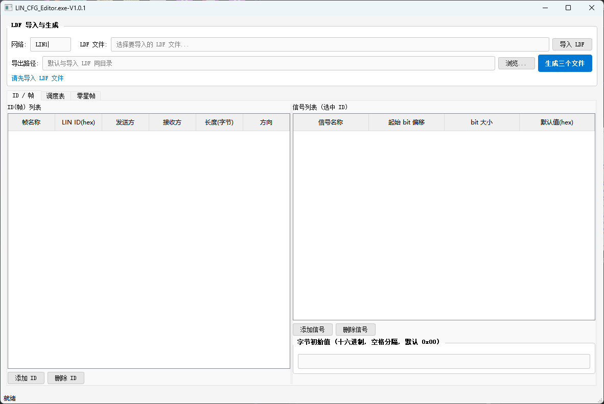
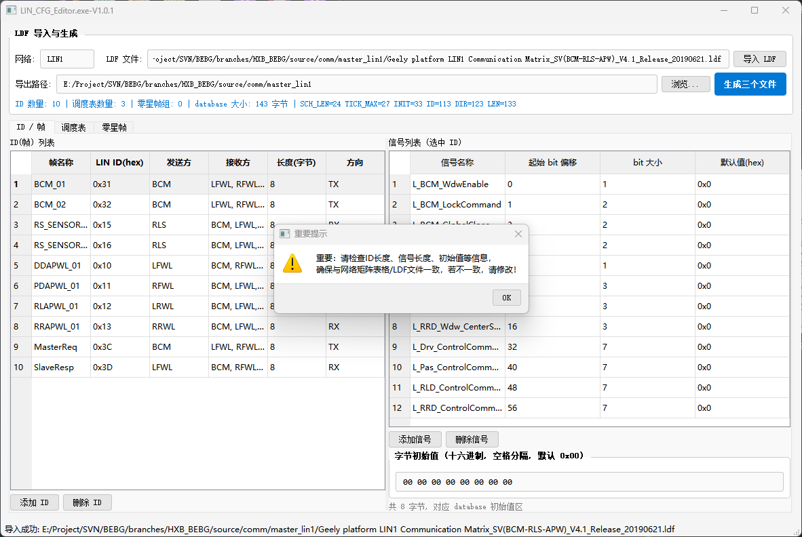
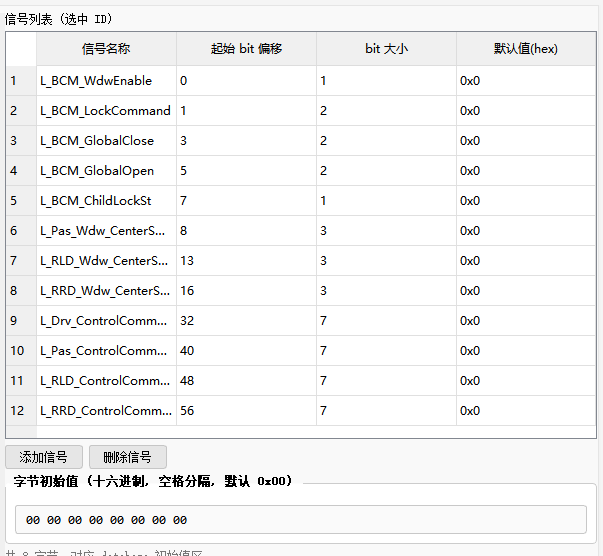
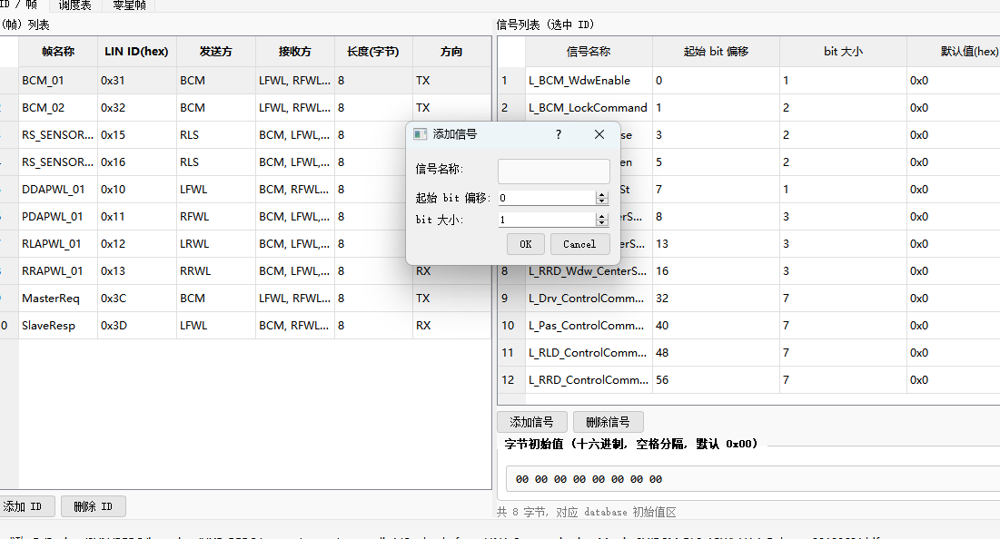
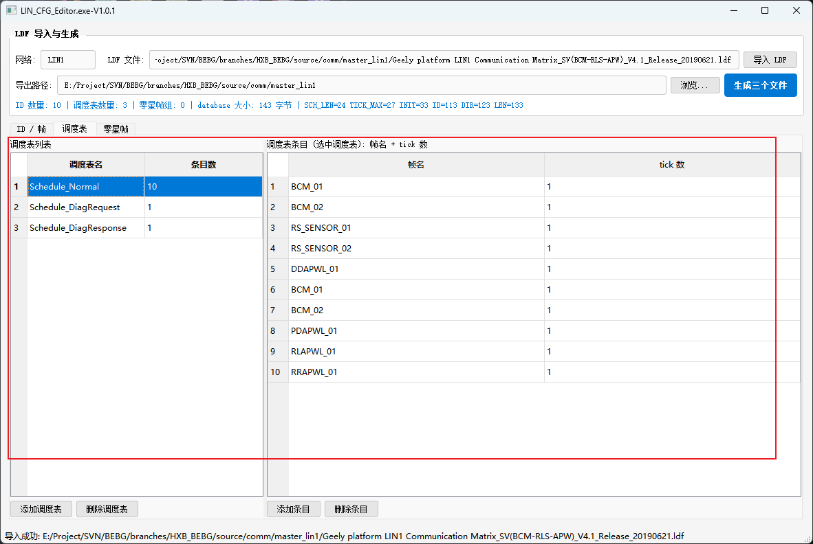
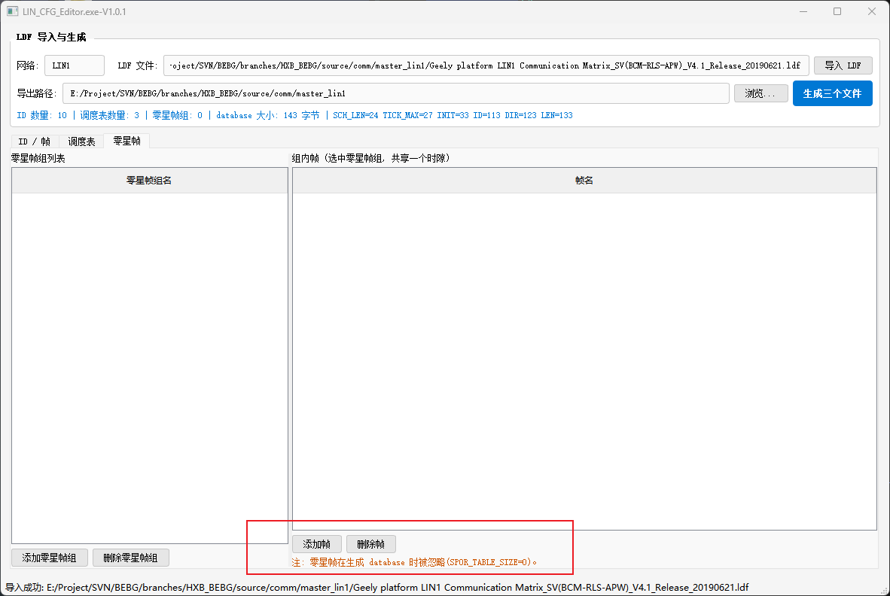

# LIN_CFG_Editor.exe使用教程

双击运行

点击导入LDF按钮将需要生成代码的LDF导入

## ID/帧页面

弹出重要提示，用户需要确认网络是自己需要生成的网段，确认导入的LDF里的信号长度正确，参考方式是对照网络矩阵excel，因为可能存在LDF本身就是错的情况，这需要用户自己修改LDF重新导入

检查默认值是否正确，可以自行修改默认值数据，也可以直接在字节初始值框修改，更为方便

点击添加信号按钮可以自行增加额外信号

## 调度表页面

调度表页面可以拖动调整调度表顺序，点击添加调度表可以新增调度表，点击添加条目，可以在调度表里新增ID

## 零星帧页面

零星帧功能由于不涉及，所以对应功能无
